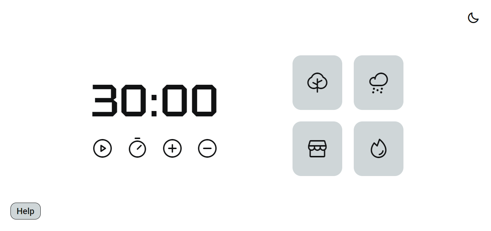
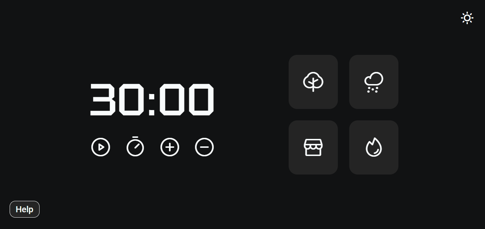
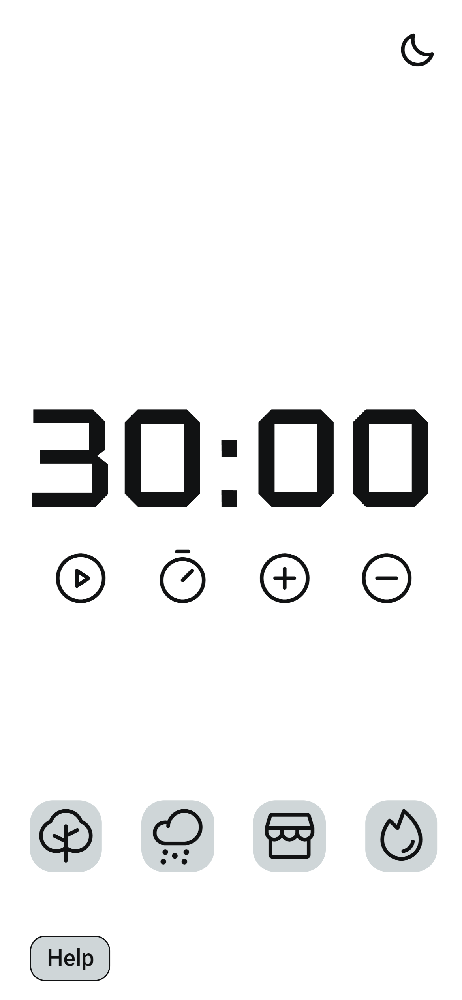
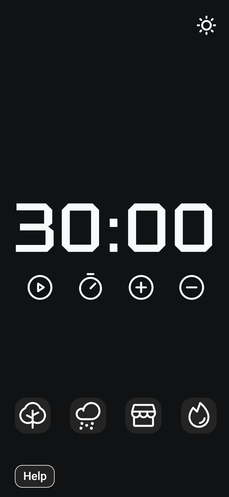

<h1 align="center"> Focus Timer. </h1>

Desenvolvimento de uma aplicação com foco na Técnica Pomodoro.

## 💻 Desk
 

  

 

  

 

## 📱 Mobile
 

 

## 🚀 Tecnologias

Esse projeto foi desenvolvido com as seguintes tecnologias:

- HTML e CSS
- JavaScript

## 🔖 Layout

Você pode visualizar o resultado clincando neste [LINK](https://kiqprado.github.io/Focus/).

---

  
  &nbsp;&nbsp;&nbsp;|&nbsp;&nbsp;&nbsp;
  
 

